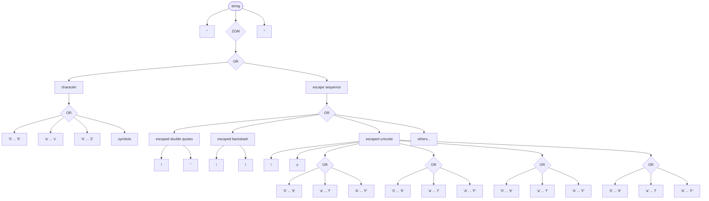

# Spl - a simple parser combinator library for C

---

This is a C library for building *parsers*, by defining *non-left-recursive* rules in a *context-free* grammar and composing them with *combinators*.

Combinators:

- **OR**
- **AND**
- **OPTIONAL**
- **ZERO OR MORE**
- **ONE OR MORE**

Ast operations:

- **WIPE**
- **SIMPLIFY**
- **FLATTEN**

## Example - json

The [included](./json.c) example is based on the [railroad diagrams](https://en.wikipedia.org/wiki/Syntax_diagram) from the [Json spec page](https://www.json.org/json-en.html), and implements a correct json parser, with limitations^[string_limitations] to the expressivity of strings.

^[string_limitations]: Variable-length encodings, such as [Unicode](https://en.wikipedia.org/wiki/Unicode), are not supported. Also not all ASCII characters have been inserted in the example.

It makes sense to start and develop the simpler aspects of the grammar first, so that we can catch bugs in our thought process from the beginning. A *number* is already a valid Json sentence, so let's start by modelling numbers.

### Numbers


Notice how the integer part of the number is the only one that must always be included, and how it is either a `'0'` or a number that does not start with zero. For this latter case, we would casually say: "we want a series of digits where the first one is NOT a 0". Unfortunately our library does not provide us with rules that can specify *negation*. But this is not a fundamental limit: we can overcome this obstacle by detecting a first digit ranging from `'1'` to `'9'` and then starting a detection of zero or more digits that range from `'0'` to `'9'`. Instead describing rules for what is not accepted by our grammar we need to explicitly lay down the domain of the rules that are accepted.

```c
zero = rule_c('0');
non_zero_digit = rule_range('1', '9');

minus = rule_c('-');
optional_minus = rule_optional(minus);

digit = rule_or(non_zero_digit, zero, NULL);
zero_or_more_digits = rule_zero_or_more(digit);
one_or_more_digits = rule_one_or_more(digit);
non_zero_starting_digits = rule_and(non_zero_digit, zero_or_more_digits, NULL);
non_decimal_part = rule_or(zero, non_zero_starting_digits, NULL);

point = rule_c('.');
decimal_part = rule_and(point, one_or_more_digits, NULL);
optional_decimal_part = rule_optional(decimal_part);

exponent = rule_or(rule_c('e'), rule_c('E'), NULL);
sign = rule_or(minus, rule_c('+'), NULL);
optional_sign = rule_optional(sign);
exponential_part = rule_and(exponent, optional_sign, one_or_more_digits, NULL);
optional_exponential_part = rule_optional(exponential_part);

number = rule_and(optional_minus, non_decimal_part, optional_decimal_part, optional_exponential_part, NULL);
```

### Strings

*Strings* are series of characters surrounded by double quotes. Here we are only dealing with [ASCII](https://en.wikipedia.org/wiki/ASCII) encodings, that is, we are dealing with 1 byte chars^[string_limitations]. Some [escape sequences](https://en.wikipedia.org/wiki/Escape_character), for example the escaped double quotes `\"` and escaped backslash `\\`, are allowed in any place in between the double quotes.



Some more escape sequences are allowed. Notice how 

```c
space = rule_c(' ');
dq = rule_c('"');

character = rule_or(digit, rule_range('a', 'z'), rule_range('A', 'Z'), minus, point, space, NULL);
characters = rule_zero_or_more(character);

backslash = rule_c('\\');
escaped_quotation_mark = rule_and(backslash, dq, NULL);
escaped_backslash = rule_and(backslash, backslash, NULL);
hex = rule_or(rule_range('a', 'f'), rule_range('A', 'F'), digit, NULL);
escaped_unicode = rule_and(backslash, rule_c('u'), hex, hex, hex, hex, NULL);
escaped_forward_slash = rule_and(backslash, rule_c('/'), NULL);
escaped_backspace = rule_and(backslash, rule_c('b'), NULL);
escaped_formfeed = rule_and(backslash, rule_c('f'), NULL);
escaped_linefeed = rule_and(backslash, rule_c('n'), NULL);
escaped_cr = rule_and(backslash, rule_c('r'), NULL);
escaped_tab = rule_and(backslash, rule_c('t'), NULL);

escape = rule_or(escaped_unicode, escaped_backslash, escaped_forward_slash, escaped_backspace, escaped_formfeed, escaped_linefeed, escaped_cr, escaped_tab, escaped_quotation_mark, NULL);

zero_or_more_optional_escapes_or_characters = rule_zero_or_more(rule_or(character, escape, NULL));

string = rule_and(dq, zero_or_more_optional_escapes_or_characters, dq, NULL);
```


*Arrays* are lists of *values*. Note that we are not defining what a value is for now. We are only declaring it. Because of the expressive limitations of our combinators, we need to describe a bunch of cases for how arrays are shaped. They can be *empty* (`[]`), containing only *one* element (`[1]`), or *many* (`[1,2,3]`).

```c
value = malloc(sizeof(rule));
comma = rule_c(',');
value_and_comma = rule_and(value, ws, comma, ws, NULL);

empty_array = rule_and(lsb, ws, rsb, NULL);
one_element_array = rule_and(lsb, ws, value, ws, rsb, NULL);
one_or_more_values = rule_one_or_more(value_and_comma);
many_elements_array =
 rule_and(lsb, ws, one_or_more_values, ws, value, ws, rsb, NULL);

array = rule_or(many_elements_array, one_element_array, empty_array, NULL);
```

*Objects* are maps for *keys* and *values*.

Finally, we can define *Values* as either *numbers*, *strings*, *booleans*, *nulls*, *arrays* or *objects*.


This has to be done "manually", indicating how many child rules `value` has.

```c
value->method = OR;
value->id = rule_new_id();
value->n_childs = 6;
value->childs = malloc(sizeof(rule *) * value->n_childs);
value->childs[0] = number;
value->childs[1] = string;
value->childs[2] = boolean;
value->childs[3] = null;
value->childs[4] = array;
value->childs[5] = object;
```
