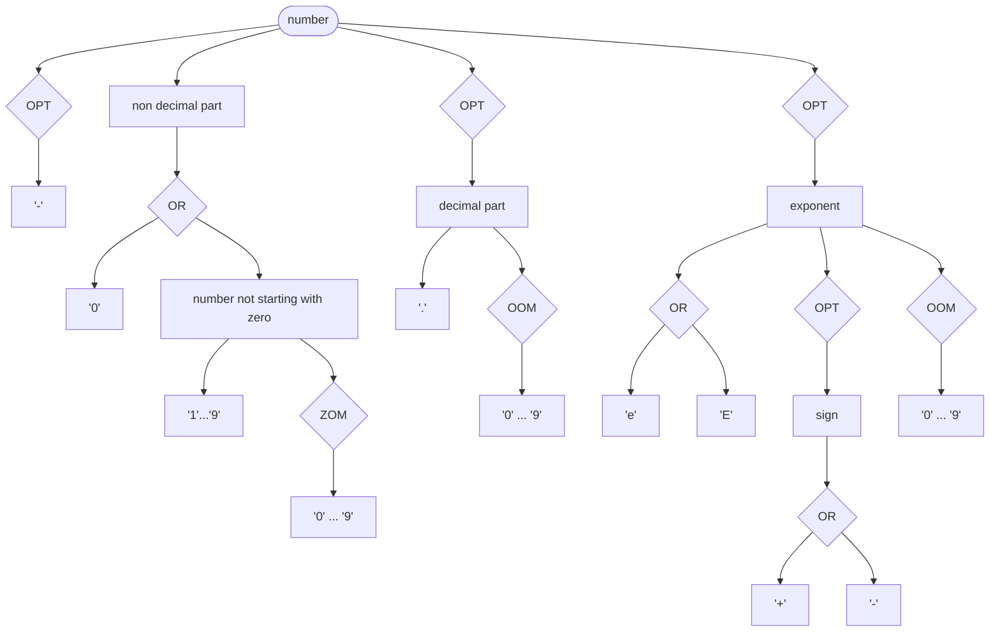
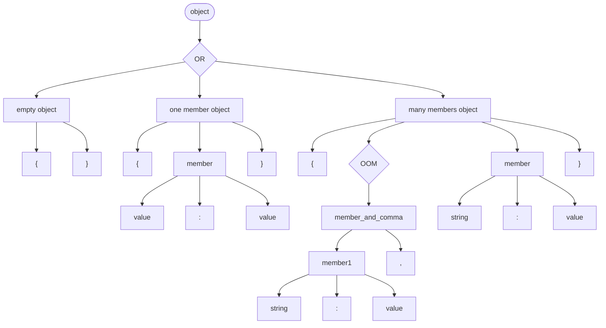
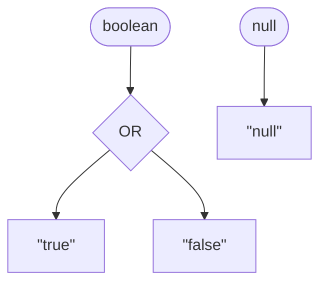

# Spl - a simple parser combinator library for C

---

This is a C library for building *parsers*, by defining *non-left-recursive* rules in a *context-free* grammar and composing them with *combinators*, and operating on the resulting *abstract syntax trees*.

## Features

Including Spl in your project is simple, just copy the `.c` and `.h` files in one of your projects subdirectories and add the `.c` files to your compilers sources. The library provides the function:

```c
parse_result parse(char *text, rule *r);
```

Which consumes some `text` as input and determines if it respects the grammar rules `r`.

```c
char *text = "123";
rule *num = rule_add_name(rule_one_or_more(rule_range('0', '9')), "num");
parse_result pr = parse(text, num);

if (pr.matched == MATCHED) {
	ast *a = pr.node;
	ast_collapse(a, num);
	char *s = ast_to_string(a);
	printf("%s\n", s); // {"content":"123"}
	free(s);
}

rule_free(&num);
parse_result_free(pr);
```

A `parse_result` struct has a `matched` field that can be either `MATCHED` or `NOT_MATCHED`, and a `node` field that holds the abstract syntax tree that is built from the text, if the text matches the grammar.

### Rules

To define a grammar we need to define rules for it, and `rule.h` provides some methods to help us with that.

- `rule *rule_c(char c)`: creates a rule that matches a character `c`.

This is the fundamental building block for our grammars: complex behaviour can emerge with the use of **combinators**.

- `rule *rule_literal(char *literal)`: creates a rule that matches a non-ambiguous sequence of characters, `literal`.
- `rule *rule_or(rule r0, ...)`: is a function with variable arguments: rules that can match alternatively. It has to be terminated with a `NULL` value. The parser tries every passed rule in order until it finds one that matches. If none of those rules match, the whole *OR* does not match.
- `rule *rule_and(rule r0, ...)`: is again a function with variable rule pointer arguments, and has to be terminated with a `NULL`. This time, all the rules have to match in order.
- `rule *range(char c1, char c2)`: creates a range of rules in *OR*. Either of the characters ranging in order from `c1` to `c2`, including the bounds, will match.
- `rule *repeat(rule *r, int n)`: repeats the rule `r` `n` times. It will only make sense to use it inside of a `rule_and()` definition.
- `rule *optional(rule *r)`: makes the rule `r` optional, it can be matched either 0 times or 1.
- `rule *rule_zero_or_more(rule *r)`: will let `r` be matched zero or more times.
- `rule *rule_one_or_more(rule *r)`: will let `r` be matched one or more times. Internally *a one or more* rule is defined as: `rule *rule_one_or_more(rule *r) {return rule_and(r, rule_zero_or_more(r), NULL); }`. The effects of this are showed below.

There are
- `rule *rule_add_name(rule *r, char *name)`: gives a name to a rule. After parsing, AST nodes that derived from `r`'s match will inherit the same name.
- `rule *rule_add_callback(rule *r, void (*callback)(ast *self))`: sets a `void callback(ast *self)` function to a rule. AST nodes that derive from `r`'s match will be able to call the `callback` function on themselves.
- `char *rule_print(rule *r)`: prints a rule, recursively with its children rules, to standard output and in Json format. Already printed rules are omitted, to avoid infinite loops in circular definitions. The output from from the snippet [above](#features):

```json
{ "name": "num", "method": "AND", "definition": [
	{ "method": "OR", "definition": [
		{ "c": "0" },
		{ "c": "1" },
		{ "c": "2" },
		{ "c": "3" },
		{ "c": "4" },
		{ "c": "5" },
		{ "c": "6" },
		{ "c": "7" },
		{ "c": "8" },
		{ "c": "9" }
	]},
	{ "method": "ZERO_OR_MORE", "definition": [
		{ "method": "OR", "already_printed": true }
	]}
]}
```

### Abstract syntax trees

After successful parsing, Abstract syntax tree is the data structure that can be explored by the user of this library. Here is the type definition:

```c
typedef struct ast {
	struct ast *parent;
	struct ast *child;
	struct ast *next;
	struct ast *prev;
	int n_childs;

	int ruleid;

	char *name;
	char *content;

	void (*callback)(struct ast *self);
} ast;
```

In the snippet [above](#features), after the text has been parsed, the resulting abstract syntax tree corresponds to: 

```json
{"name": "num", "children": [
	{"children": [
		{"content": "1"}
	]},
	{"children": [
		{"children": [
			{"content": "2"}
		]},
		{"children": [
			{"content": "3"}
		]}
	]}
]}
```

Notice how this structure matches the one of the rule. The rule method is now omitted but, for the `ZERO_OR_MORE` rule, two children nodes have matched: the one with inner content `"2"` and the one with inner content `"3"`.

Trees like this can be very redundant, so it is a good idea to **clean** them with the use of the following functions:

- `void ast_wipe(ast *node, struct rule* r)`: this function explores `node`, and strips it of any branch that was added because of a rule `r`.
- `void ast_collapse(ast *node, struct rule* rule)`: this function alters `node` in such a way that the content of *all the branches that origin from a node added because of a rule `r`* is collapsed into the content of that very node. Children nodes are thus removed.
- `void ast_simplify(ast *node, struct rule* rule)`: this function removes unwanted nodes but keeps their children. `node` is explored and every time a node that was added because of a rule `r` is met, that very node is taken away, and its children are assigned to its parent node.

For consuming the parsed AST, the programmer has freedom in choice. One might consider [depth first search](https://en.wikipedia.org/wiki/Depth-first_search) or [breadth first search](https://en.wikipedia.org/wiki/Breadth-first_search).

## An example: the Json format

The [included](./json.c) example is based on the [railroad diagrams](https://en.wikipedia.org/wiki/Syntax_diagram) from the [Json spec page](https://www.json.org/json-en.html), and implements a correct json parser, with some limitations[^string_limitations] to the expressivity of strings.

[^string_limitations]: Variable-length encodings, such as [Unicode](https://en.wikipedia.org/wiki/Unicode), are not supported. Also not all ASCII characters have been inserted in the example.

It makes sense to start and develop the simpler aspects of the grammar first, so that we can catch bugs in our thought process from the beginning. A *number* is already a valid Json sentence, so let's start by modelling numbers.

### Numbers

Numbers in Json can be anything like `0`, `1`, `1968`, `3.14159`, `-1230.445e-8`. Here is a graph that formalizes the constraints for what a number is. We are indicating *OR*s, *OPTIONAL*s, *ZERO OR MORE*s, *ONE OR MORE*s and *REPEAT*(*n*)s with the diamond shape. A *RANGE* from the character `'f'` to the character `'t'` is here denoted with `'f' ... 't'`, and *AND*s are simply the many arrows that draw out of a block.



Notice how the integer part of the number is the only one that must always be included, and how it is either a `'0'` or a number that does not start with zero. For this latter case, we would casually say: "we want a series of digits where the first one is NOT a 0". Unfortunately our library does not provide us with rules that can specify *negation*. But this is not a fundamental limit: we can overcome this obstacle by detecting a first digit ranging from `'1'` to `'9'` and then starting a detection of zero or more digits that range from `'0'` to `'9'`. Instead describing rules for what is not accepted by our grammar we need to explicitly lay down the domain of the rules that are accepted.

```c
zero = rule_c('0');
non_zero_digit = rule_range('1', '9');

minus = rule_c('-');
optional_minus = rule_optional(minus);

digit = rule_or(non_zero_digit, zero, NULL);
zero_or_more_digits = rule_zero_or_more(digit);
one_or_more_digits = rule_one_or_more(digit);
non_zero_starting_digits = rule_and(non_zero_digit, zero_or_more_digits, NULL);
non_decimal_part = rule_or(zero, non_zero_starting_digits, NULL);

point = rule_c('.');
decimal_part = rule_and(point, one_or_more_digits, NULL);
optional_decimal_part = rule_optional(decimal_part);

exponent = rule_or(rule_c('e'), rule_c('E'), NULL);
sign = rule_or(minus, rule_c('+'), NULL);
optional_sign = rule_optional(sign);
exponential_part = rule_and(exponent, optional_sign, one_or_more_digits, NULL);
optional_exponential_part = rule_optional(exponential_part);

number = rule_and(optional_minus, non_decimal_part, optional_decimal_part, optional_exponential_part, NULL);
```

We are keeping references to the intermediate rules, such as `digit`, not only to keep code clean and possibly reuse our carefully built rules, but also to later clean the AST of unwanted nodes that were added because of those very intermediate rules.

### Strings

*Strings* are series of characters surrounded by double quotes. Here we are only dealing with [ASCII](https://en.wikipedia.org/wiki/ASCII) encodings, that is, we are dealing with 1 byte chars[^string_limitations]. Some [escape sequences](https://en.wikipedia.org/wiki/Escape_character), for example the escaped double quotes `\"` and escaped backslash `\\`, are allowed in any place in between the double quotes.


A way of saying that, at any point in the sequence, either a simple character or an escape sequence can appear, is encapsulating an *OR* between *characters* and *escape sequences* in a *ZERO OR MORE* rule.

```c
space = rule_c(' ');
dq = rule_c('"');

character = rule_or(digit, rule_range('a', 'z'), rule_range('A', 'Z'), minus, point, space, NULL);
characters = rule_zero_or_more(character);

backslash = rule_c('\\');
escaped_quotation_mark = rule_and(backslash, dq, NULL);
escaped_backslash = rule_and(backslash, backslash, NULL);
hex = rule_or(rule_range('a', 'f'), rule_range('A', 'F'), digit, NULL);
escaped_unicode = rule_and(backslash, rule_c('u'), rule_repeat(hex, 4), NULL);
escaped_forward_slash = rule_and(backslash, rule_c('/'), NULL);
escaped_backspace = rule_and(backslash, rule_c('b'), NULL);
escaped_formfeed = rule_and(backslash, rule_c('f'), NULL);
escaped_linefeed = rule_and(backslash, rule_c('n'), NULL);
escaped_cr = rule_and(backslash, rule_c('r'), NULL);
escaped_tab = rule_and(backslash, rule_c('t'), NULL);

escape = rule_or(escaped_unicode, escaped_backslash, escaped_forward_slash, escaped_backspace, escaped_formfeed, escaped_linefeed, escaped_cr, escaped_tab, escaped_quotation_mark, NULL);

zero_or_more_optional_escapes_or_characters = rule_zero_or_more(rule_or(character, escape, NULL));

string = rule_and(dq, zero_or_more_optional_escapes_or_characters, dq, NULL);
```

### Arrays

*Arrays* are lists of *values*, and can be *empty* (`[]`), containing only *one* element (`[1]`), or *many* (`[1,2,3]`).


Arrays have rules also for whitespaces, which can be space characters, tabs, and new lines. Note that we are not defining what a value is for now, we are only declaring it.

```c
value = rule_new();

space = rule_c(' ');
tab = rule_c('\t');
linefeed = rule_c('\n');
cr = rule_c('\r');

ws = rule_zero_or_more(rule_or(space, tab, linefeed, cr, NULL));

lsb = rule_c('[');
rsb = rule_c(']');
comma = rule_c(',');
value_and_comma = rule_and(value, ws, comma, ws, NULL);

empty_array = rule_and(lsb, ws, rsb, NULL);
one_element_array = rule_and(lsb, ws, value, ws, rsb, NULL);
one_or_more_values = rule_one_or_more(value_and_comma);
many_elements_array = rule_and(lsb, ws, one_or_more_values, ws, value, ws, rsb, NULL);

array = rule_or(empty_array, one_element_array, many_elements_array, NULL);
```

It might also seem interesting to define our array rule somewhat like this:


```c
value_and_comma = rule_and(value, ws, comma, ws, NULL);
one_or_more_values = rule_one_or_more(value_and_comma);
many_elements = rule_and(one_or_more_values, ws, value, NULL);

value_or_many_elements = rule_or(many_elements, value, NULL); // order is important!
optional_elements = rule_optional(value_or_many_elements);

array = rule_and(lsb, ws, optional_elements, ws, rsb, NULL);
```

And it would totally work. Note that in this case we have to be careful with the order the *OR*'s child rules, so that the backtracking system works as expected. In the first implementation, when the backtracker fails, the text to be consumed by the next try is restored fully: if the array is not empty the parser starts back from the initial `[`. In the second implementation, the rules *one_or_more_values* and *value* share the same prefix. This is a more delicate case, that can be explained with this example:

```plaintext
[ 1, 2 ]
  ^
  it is important that the parser is first trying to match for a *many_elements* rule.
  if we defined our grammar so that the parser would first be matching for *value*, a first match would succed, but then the remaining text would turn out to be ", 2 ]", and the parser would fail there every time, since we havent defined rules that start with a comma!

[ 1, 2 ]
     ^
     finally here the *one_or_more_values* rule fails, so the parser will try to match "2 ]" with the next rule, *value*.
     this rule matching succedes, and the parsing continues.
```

In general, and critically when rules share the same prefix, the children of *OR* rules should be sorted by their *specificity*. First the most specific (and longer), then the more general ones (and shorter).

### Objects

*Objects* are maps of *keys* and *values*. It's pretty easy to implement them after arrays.



```c
double_dots = rule_c(':');

member = rule_and(ws, string, ws, double_dots, ws, value, NULL);
member_and_comma = rule_and(member, ws, comma, ws, NULL);
one_or_more_members = rule_one_or_more(member_and_comma);

empty_object = rule_and(lcb, ws, rcb, NULL);
one_member_object = rule_and(lcb, ws, member, ws, rcb, NULL);
many_members_object = rule_and(lcb, ws, one_or_more_members, ws, member, ws, rcb, NULL);

object = rule_or(empty_object, one_member_object, many_members_object, NULL);
```

### Values altogether

There are still a couple of values that Json allows for: *booleans* and *nulls*:



Since they have no ambiguity, we can define them as literals.

```c
boolean_true = rule_literal("true");
boolean_false = rule_literal("false");
boolean = rule_or(boolean_false, boolean_true, NULL);

null = rule_literal("null");
```

Finally, we can define *values* as either *numbers*, *strings*, *booleans*, *nulls*, *arrays* or *objects*.


This is here done "manually", indicating how many child rules `value` has. Notice how the definition of what a value is is cyclic. A value can be an array, and arrays contain values. By separating the declaration and the definition of `value`, we closed the loop!

```c
value->method = OR;
value->n_childs = 6;
value->childs = malloc(sizeof(rule *) * value->n_childs);
value->childs[0] = number;
value->childs[1] = string;
value->childs[2] = boolean;
value->childs[3] = null;
value->childs[4] = array;
value->childs[5] = object;
```

### Cleaning the tree

The function `json_parse` is provided. This function tries to create an abstract syntax tree from the text `str`, and then cleans the tree of nodes that originated from intermediate rules:

1. First, characters such as double quotes, double dots, commas and brackets are removed. Empty arrays and empty objects are also wiped.
1. Then, strings, nulls, booleans and numbers are collapsed into a single node.
1. Lastly, intermediate rules are simplified: their purpose has been achieved.

```c
parse_result json_parse(char *str) {
	parse_result pr = parse(str, value);
	ast *root = pr.node;

	ast_wipe(root, dq);
	ast_wipe(root, ws);
	ast_wipe(root, comma);
	ast_wipe(root, lsb);
	ast_wipe(root, rsb);
	ast_wipe(root, lcb);
	ast_wipe(root, rcb);
	ast_wipe(root, double_dots);

	ast_wipe(root, empty_array);
	ast_wipe(root, empty_object);

	ast_collapse(root, null);
	ast_collapse(root, boolean);
	ast_collapse(root, string);
	ast_collapse(root, number);

	ast_simplify(root, value_and_comma);
	ast_simplify(root, one_element_array);
	ast_simplify(root, many_elements_array);
	ast_simplify(root, one_or_more_values);

	ast_simplify(root, member_and_comma);
	ast_simplify(root, one_or_more_members);
	ast_simplify(root, one_member_object);
	ast_simplify(root, many_members_object);

	ast_simplify(root, value);

	return pr;
}
```

Here is an instance of a Json parse, the text:

```json
{"cane": ["a", 1, -1, 0.34234, {"empty": [[]]}, -723.23, 2E10, -0.12e226, null], "CAPRA": {"cavallo": false}}
```

is parsed into:

```json
{"name":"value","children":[{"name":"object","children":[{"name":"member","children":[{"name":"string","content":"cane"},{"name":"array","children":[{"name":"string","content":"a"},{"name":"number","content":"1"},{"name":"number","content":"-1"},{"name":"number","content":"0.34234"},{"name":"object","children":[{"name":"member","children":[{"name":"string","content":"empty"},{"name":"array","children":[{"name":"array"}]}]}]},{"name":"number","content":"-723.23"},{"name":"number","content":"2E10"},{"name":"number","content":"-0.12e226"},{"name":"null","content":"null"}]}]},{"name":"member","children":[{"name":"string","content":"CAPRA"},{"name":"object","children":[{"name":"member","children":[{"name":"string","content":"cavallo"},{"name":"boolean","content":"false"}]}]}]}]}]}
```


# Future extensions

This project was brought forwards for familiarizing with the patterns and software engineering discipline in the C language. It made very little use of AI, I really tried to bump my head on bugs before resigning to ask one thing or two about the `ast_collapse_recursive` function.

- [ ] Adding parsing capabilities for files, directly. The file contents should not be first saved to a single string in memory, especially if the file is greater than the available memory.
- [ ] Memory usage criticalities should be sanitized. [Address sanitizer](https://clang.llvm.org/docs/AddressSanitizer.html) was used to detect some faults in memory management, which are still present :).
- [ ] Despite this library is flawed and in some bits inefficient, it could power a real programming language, so that's an idea for a future extension...
