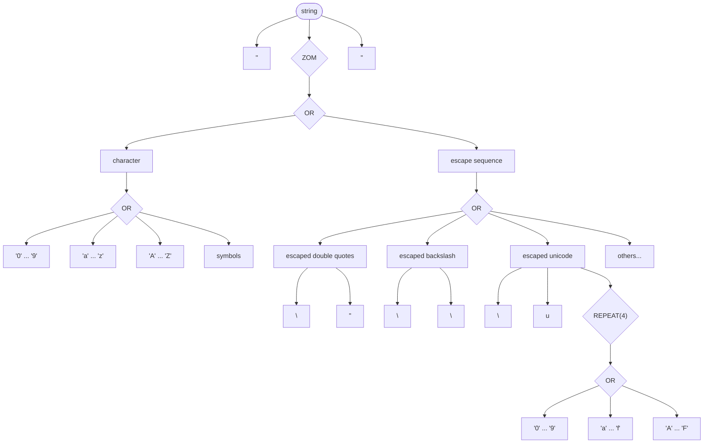
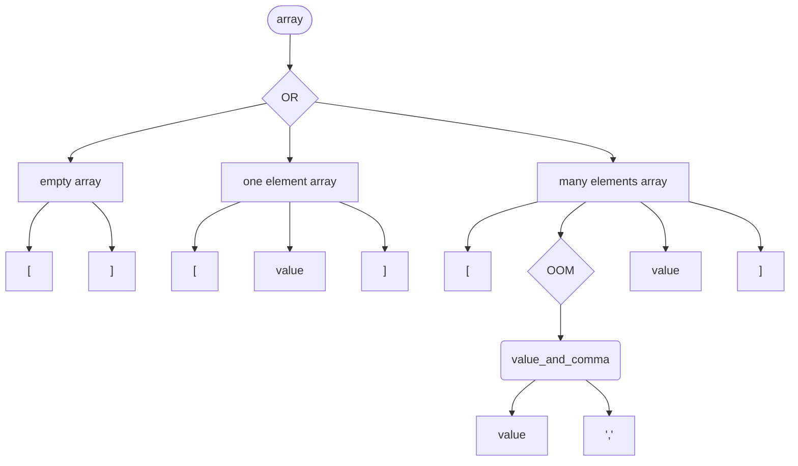
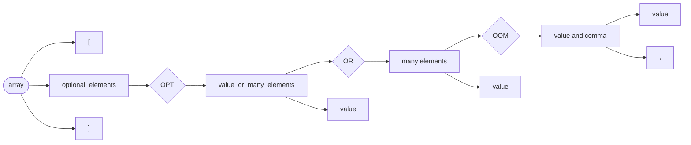
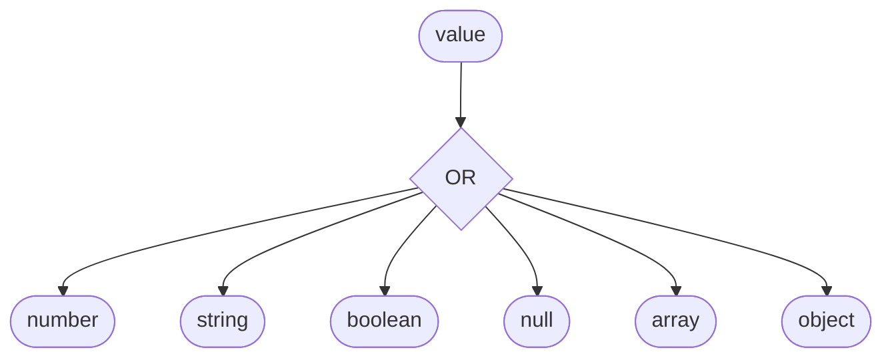

# Spl - a simple parser combinator library for C

---

This is a C library for building *parsers*, by defining *non-left-recursive* rules in a *context-free* grammar and composing them with *combinators*, and operating on the resulting *abstract syntax trees*.

## Features

Characters

Combinators:

- **OR**
 	- **RANGE**
- **AND**
 	- **REPEAT**
- **OPTIONAL** (Zero or one)
- **ZERO OR MORE**
- **ONE OR MORE**

Ast operations:

- **WIPE**
- **SIMPLIFY**
- **FLATTEN**

Tree exploration:

Including Spl in your project is simple, just copy the `.c` and `.h` files in one of your projects subdirectories and add the `.c` files to your compilers sources.

## An example: the Json format

The [included](./json.c) example is based on the [railroad diagrams](https://en.wikipedia.org/wiki/Syntax_diagram) from the [Json spec page](https://www.json.org/json-en.html), and implements a correct json parser, with some limitations[^string_limitations] to the expressivity of strings.

[^string_limitations]: Variable-length encodings, such as [Unicode](https://en.wikipedia.org/wiki/Unicode), are not supported. Also not all ASCII characters have been inserted in the example.

It makes sense to start and develop the simpler aspects of the grammar first, so that we can catch bugs in our thought process from the beginning. A *number* is already a valid Json sentence, so let's start by modelling numbers.

### Numbers

Numbers in Json can be anything like `0`, `1`, `1968`, `3.14159`, `-1230.445e-8`. Here is a graph that formalizes the constraints for what a number is. We are indicating *OR*s, *OPTIONAL*s, *ZERO OR MORE*s, *ONE OR MORE*s and *REPEAT*(*n*)s with the diamond shape. A *RANGE* from the character `'f'` to the character `'t'` is here denoted with `'f' ... 't'`, and *AND*s are simply the many arrows that draw out of a block.


Notice how the integer part of the number is the only one that must always be included, and how it is either a `'0'` or a number that does not start with zero. For this latter case, we would casually say: "we want a series of digits where the first one is NOT a 0". Unfortunately our library does not provide us with rules that can specify *negation*. But this is not a fundamental limit: we can overcome this obstacle by detecting a first digit ranging from `'1'` to `'9'` and then starting a detection of zero or more digits that range from `'0'` to `'9'`. Instead describing rules for what is not accepted by our grammar we need to explicitly lay down the domain of the rules that are accepted.

```c
zero = rule_c('0');
non_zero_digit = rule_range('1', '9');

minus = rule_c('-');
optional_minus = rule_optional(minus);

digit = rule_or(non_zero_digit, zero, NULL);
zero_or_more_digits = rule_zero_or_more(digit);
one_or_more_digits = rule_one_or_more(digit);
non_zero_starting_digits = rule_and(non_zero_digit, zero_or_more_digits, NULL);
non_decimal_part = rule_or(zero, non_zero_starting_digits, NULL);

point = rule_c('.');
decimal_part = rule_and(point, one_or_more_digits, NULL);
optional_decimal_part = rule_optional(decimal_part);

exponent = rule_or(rule_c('e'), rule_c('E'), NULL);
sign = rule_or(minus, rule_c('+'), NULL);
optional_sign = rule_optional(sign);
exponential_part = rule_and(exponent, optional_sign, one_or_more_digits, NULL);
optional_exponential_part = rule_optional(exponential_part);

number = rule_and(optional_minus, non_decimal_part, optional_decimal_part, optional_exponential_part, NULL);
```

We are keeping references to the intermediate rules, such as `digit`, not only to keep code clean and possibly reuse our carefully built rules, but also to clean the AST of unwanted nodes that were added because of those very intermediate rules.

### Strings

*Strings* are series of characters surrounded by double quotes. Here we are only dealing with [ASCII](https://en.wikipedia.org/wiki/ASCII) encodings, that is, we are dealing with 1 byte chars[^string_limitations]. Some [escape sequences](https://en.wikipedia.org/wiki/Escape_character), for example the escaped double quotes `\"` and escaped backslash `\\`, are allowed in any place in between the double quotes.



A way of saying that, at any point in the sequence, either a simple character or an escape sequence can appear, is encapsulating an *OR* between *characters* and *escape sequences* in a *ZERO OR MORE* rule.

```c
space = rule_c(' ');
dq = rule_c('"');

character = rule_or(digit, rule_range('a', 'z'), rule_range('A', 'Z'), minus, point, space, NULL);
characters = rule_zero_or_more(character);

backslash = rule_c('\\');
escaped_quotation_mark = rule_and(backslash, dq, NULL);
escaped_backslash = rule_and(backslash, backslash, NULL);
hex = rule_or(rule_range('a', 'f'), rule_range('A', 'F'), digit, NULL);
escaped_unicode = rule_and(backslash, rule_c('u'), rule_repeat(hex, 4), NULL);
escaped_forward_slash = rule_and(backslash, rule_c('/'), NULL);
escaped_backspace = rule_and(backslash, rule_c('b'), NULL);
escaped_formfeed = rule_and(backslash, rule_c('f'), NULL);
escaped_linefeed = rule_and(backslash, rule_c('n'), NULL);
escaped_cr = rule_and(backslash, rule_c('r'), NULL);
escaped_tab = rule_and(backslash, rule_c('t'), NULL);

escape = rule_or(escaped_unicode, escaped_backslash, escaped_forward_slash, escaped_backspace, escaped_formfeed, escaped_linefeed, escaped_cr, escaped_tab, escaped_quotation_mark, NULL);

zero_or_more_optional_escapes_or_characters = rule_zero_or_more(rule_or(character, escape, NULL));

string = rule_and(dq, zero_or_more_optional_escapes_or_characters, dq, NULL);
```

### Arrays

*Arrays* are lists of *values*, and can be *empty* (`[]`), containing only *one* element (`[1]`), or *many* (`[1,2,3]`).



Arrays have rules also for whitespaces, which can be space characters, tabs, and new lines. Note that we are not defining what a value is for now, we are only declaring it. 

```c
value = rule_new();

space = rule_c(' ');
tab = rule_c('\t');
linefeed = rule_c('\n');
cr = rule_c('\r');

ws = rule_zero_or_more(rule_or(space, tab, linefeed, cr, NULL));

lsb = rule_c('[');
rsb = rule_c(']');
comma = rule_c(',');
value_and_comma = rule_and(value, ws, comma, ws, NULL);

empty_array = rule_and(lsb, ws, rsb, NULL);
one_element_array = rule_and(lsb, ws, value, ws, rsb, NULL);
one_or_more_values = rule_one_or_more(value_and_comma);
many_elements_array = rule_and(lsb, ws, one_or_more_values, ws, value, ws, rsb, NULL);

array = rule_or(empty_array, one_element_array, many_elements_array, NULL);
```

It might also seem interesting to define our array rule somewhat like this:



```c
value_and_comma = rule_and(value, ws, comma, ws, NULL);
one_or_more_values = rule_one_or_more(value_and_comma);
many_elements = rule_and(one_or_more_values, ws, value, NULL);

value_or_many_elements = rule_or(many_elements, value, NULL); // order is important!
optional_elements = rule_optional(value_or_many_elements);

array = rule_and(lsb, ws, optional_elements, ws, rsb, NULL);
```

And it would totally work. Note that in this case we have to be careful with the order the *OR*'s child rules, so that the backtracking system works as expected. In the first implementation, when the backtracker fails, the text to be consumed by the next try is restored fully: if the array is not empty the parser starts back from the initial `[`. In the second implementation, the rules *one_or_more_values* and *value* share the same prefix. This is a more delicate case, that can be explained with this example:

```plaintext
[ 1, 2 ]
  ^
  it is important that the parser is first trying to match for a *many_elements* rule.
  if we defined our grammar so that the parser would first be matching for *value*, a first match would succed, but then the remaining text would turn out to be ", 2 ]", and the parser would fail there every time, since we havent defined rules that start with a comma!

[ 1, 2 ]
     ^
     finally here the *one_or_more_values* rule fails, so the parser will try to match "2 ]" with the next rule, *value*.
     this rule matching succedes, and the parsing continues.
```


In general, and critically when rules share the same prefix, the children of *OR* rules should be sorted by their *specificity*. First the most specific (and longer), then the more general ones (and shorter).

### Objects

*Objects* are maps of *keys* and *values*. It's pretty easy to implement them after arrays.


```c
double_dots = rule_c(':');

member = rule_and(ws, string, ws, double_dots, ws, value, NULL);
member_and_comma = rule_and(member, ws, comma, ws, NULL);
one_or_more_members = rule_one_or_more(member_and_comma);

empty_object = rule_and(lcb, ws, rcb, NULL);
one_member_object = rule_and(lcb, ws, member, ws, rcb, NULL);
many_members_object = rule_and(lcb, ws, one_or_more_members, ws, member, ws, rcb, NULL);

object = rule_or(empty_object, one_member_object, many_members_object, NULL);
```


### Values altogether

There are still a couple of values that Json allows for: *booleans* and *nulls*:


Since they have no ambiguity, we can define them as literals.

```c
boolean_true = rule_literal("true");
boolean_false = rule_literal("false");
boolean = rule_or(boolean_false, boolean_true, NULL);

null = rule_literal("null");
```

Finally, we can define *Values* as either *numbers*, *strings*, *booleans*, *nulls*, *arrays* or *objects*.



This has to be done "manually", indicating how many child rules `value` has.

```c
value->method = OR;
value->n_childs = 6;
value->childs = malloc(sizeof(rule *) * value->n_childs);
value->childs[0] = number;
value->childs[1] = string;
value->childs[2] = boolean;
value->childs[3] = null;
value->childs[4] = array;
value->childs[5] = object;
```

# Future extensions

Despite this library is flawed and in some bits inefficient, it could power a real programming language, so that's an idea for a future extension...
